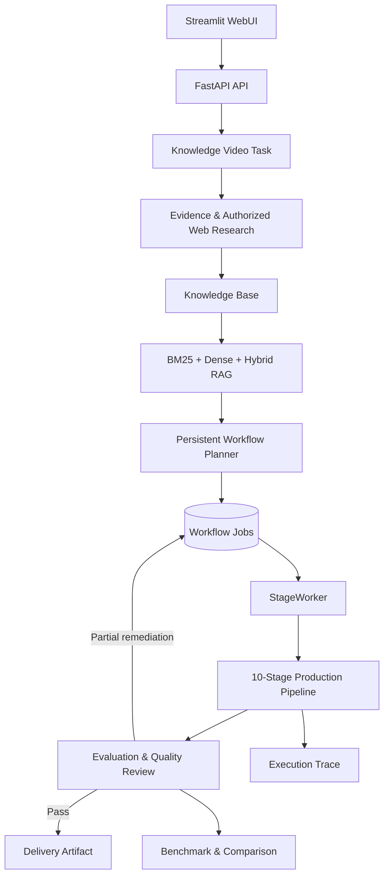

<div align="center">

# MoneyPrinterTurbo · Agentic Knowledge Video Edition 💸

### 基于知识与证据的 Agentic 视频生产工作流

只需提供视频<b>主题</b>或<b>关键词</b>，即可自动生成视频脚本、匹配素材、生成字幕和背景音乐，并合成高清短视频。

[](https://github.com/harry0703/MoneyPrinterTurbo/releases)
[](https://github.com/harry0703/MoneyPrinterTurbo/releases/latest)
[](https://www.python.org/)
[](https://github.com/harry0703/MoneyPrinterTurbo/releases/latest)

<a href="https://trendshift.io/repositories/8731" target="_blank"></a>
<a href="https://www.star-history.com/harry0703/moneyprinterturbo"></a>

简体中文 | [English](README-en.md) | [日本語](README-ja.md) | [版本发布](https://github.com/harry0703/MoneyPrinterTurbo/releases) | [问题反馈](https://github.com/harry0703/MoneyPrinterTurbo/issues)

</div>

> [!IMPORTANT]
> **本仓库是基于 [harry0703/MoneyPrinterTurbo](https://github.com/harry0703/MoneyPrinterTurbo) 的二次开发项目。**
> 上游项目提供了 AI 短视频生成基础能力；本分支进一步实现了证据驱动、可持久化、可评测、可局部恢复的知识视频 Agent 生产系统。

## 二次开发项目概览 🧠

> 从“输入主题后生成视频”扩展到“基于知识与证据，经过规划、生产、验证和修复后交付视频”的完整 Agent 工作流。

[查看二次开发完整差异](https://github.com/pologggh/MoneyPrinterTurbo/compare/main...feat/agentic-knowledge-video) · [查看开发提交历史](https://github.com/pologggh/MoneyPrinterTurbo/commits/feat/agentic-knowledge-video) · [阅读统一工作流设计](docs/superpowers/specs/2026-09-11-knowledge-video-agent-unified-workflow-design.md) · [本地开发指南](docs/DEVELOPMENT.md)

## 30 秒看懂这次二次开发

原版 MoneyPrinterTurbo 主要解决“如何快速生成一条短视频”。本分支重点解决知识型视频生产中的另一组问题：信息从哪里来、如何检索、如何形成可审查的脚本与分镜、失败后如何局部恢复，以及最终结果如何被评测和追踪。

| 维度 | Original MoneyPrinterTurbo | Agentic Knowledge Video Edition |
| --- | --- | --- |
| 输入 | 主题、关键词或已有文案 | 主题、知识库、文件证据和授权 Web Research |
| 知识检索 | 以素材搜索为主 | BM25、Dense Embedding、Hybrid RAG 与自动回退 |
| 执行方式 | 单次视频生成流水线 | 持久化 Job 驱动的十阶段 Agent 工作流 |
| 内容可信度 | 依赖模型生成结果 | Evidence、Source、Chunk、Citation 全链路溯源 |
| 分镜控制 | 自动生成后进入生产 | 草稿、编辑、审批、局部重规划和增量重跑 |
| 生产编排 | 素材、配音、字幕和合成 | Production Plan、供应商路由、资产执行、音频、合成和交付 |
| 质量控制 | 生成完成后输出 | 多维评测、受控 remediation 和失败恢复 |
| 可观测性 | 任务状态和最终文件 | WorkflowJob、Artifact、Trace、Evaluation 与 Benchmark |

## 系统架构



系统采用 API、持久化任务、独立 Worker 和阶段执行器分离的结构。Web 请求只负责创建或控制任务，`StageWorker` 从数据库认领 Job，再通过注册表找到对应执行器。每个阶段产出可追踪 Artifact，并由工作流状态机决定进入下一阶段、局部重跑或停止。

## 十阶段知识视频工作流

```text
Evidence
  → Knowledge Plan
  → Script
  → Storyboard
  → Production Plan
  → Asset
  → Audio
  → Composition
  → Quality Review
  → Delivery
```

阶段顺序由 [`Stage`](app/domain/workflow_state.py) 和 `STAGE_ORDER` 统一定义；生产实现通过 [`StageExecutorRegistry`](app/application/stage_executor_registry.py) 注册，在线模式和离线 E2E 模式复用同一组真实阶段执行器。

## 我的核心工程工作

### 1. Evidence 与知识检索

- 建立 Evidence、SourceDocument、KnowledgeChunk 和检索快照等领域模型。
- 支持文件解析、切片、任务级知识库和来源关联。
- 实现授权 Web Research，并持久化搜索与抓取结果。
- 实现 BM25、Dense Embedding、Hybrid RAG、RRF 融合和向量不可用时的 BM25 fallback。
- 提供 BM25 / Dense / Hybrid 三种模式的检索 Benchmark。

代码入口：[`app/services/knowledge/`](app/services/knowledge) · [`evidence_service.py`](app/application/evidence_service.py) · [`knowledge_retrieval_service.py`](app/application/knowledge_retrieval_service.py)

### 2. 持久化 Agent 工作流

- 将视频生产拆分为十个具备明确输入、输出和状态边界的 Stage。
- 使用持久化 `WorkflowJob`、幂等键、租约和 fencing 处理重复执行与并发认领。
- 通过独立 `StageWorker` 执行后台任务，API 进程不承担长时间生产工作。
- 为失败任务提供重试、恢复、增量执行和阶段级结果持久化。

代码入口：[`knowledge_video_workflow.py`](app/application/knowledge_video_workflow.py) · [`stage_worker.py`](app/workers/stage_worker.py) · [`workflow_state.py`](app/domain/workflow_state.py)

### 3. 分镜工作台与生产编排

- 实现从知识计划到脚本、分镜和 Production Plan 的逐级产物转换。
- 支持分镜草稿、人工审批、beat 级局部重规划和版本快照。
- 引入资产能力注册、供应商探测、质量感知复用和路由计划执行。
- 提供 WebUI 分镜工作台、知识库管理和任务操作界面。

代码入口：[`storyboard_workbench.py`](webui/storyboard_workbench.py) · [`storyboard.py`](app/controllers/v1/storyboard.py) · [`asset_route_planning_service.py`](app/services/asset_route_planning_service.py)

### 4. 质量评测与局部修复

- 对镜头素材、音视频和合成结果执行维度化评测。
- 基于冻结证据进行 Quality Review，避免评测阶段重新搜索导致标准漂移。
- 通过确定性策略选择接受、局部重试、重新规划或停止。
- 只重做失败范围，避免无边界地重新执行整条视频流水线。

代码入口：[`quality_review_stage_executor.py`](app/application/quality_review_stage_executor.py) · [`app/services/evaluation/`](app/services/evaluation) · [`quality_remediation_policy.py`](app/domain/quality_remediation_policy.py)

### 5. Trace、Benchmark 与工程化运行

- 记录任务、阶段、工具输出、Artifact、Evaluation 和 remediation 决策。
- 提供生产 Benchmark、报告导出、结果比较和门禁能力。
- 增加 SQLite / PostgreSQL 数据库生命周期管理和 25 个迁移版本。
- 提供统一开发启动器，一次启动 Backend、StageWorker 和 WebUI。
- 提供不依赖真实外部供应商的离线 E2E 执行模式。

代码入口：[`trace_service.py`](app/services/trace_service.py) · [`app/services/benchmark/`](app/services/benchmark) · [`migrations/versions/`](migrations/versions) · [`dev.py`](dev.py)

## 工程规模

以下数据来自 `main...feat/agentic-knowledge-video` 的实际 Git 差异与仓库文件统计：

| 指标 | 数量 |
| --- | ---: |
| 核心设计与功能提交 | 22 |
| 变更文件 | 336 |
| 变更的应用层 Python 文件 | 124 |
| 新增测试文件 | 127 |
| 数据库迁移版本 | 25 |
| 当前仓库测试文件 | 188 |

这些数字用于说明实现范围，不代表本次 README 更新重新执行了完整测试套件。测试代码覆盖领域模型、持久化、API、Worker、知识检索、分镜、生产执行、质量评测和离线集成路径。

## 快速启动二次开发版本

本地轻量模式默认使用 SQLite，并同时启动 FastAPI、StageWorker 和 Streamlit WebUI。

### Windows

```powershell
.\dev.bat
```

### macOS / Linux

```bash
sh dev.sh
# 或
python3 dev.py
```

### Docker Compose

```bash
docker compose up -d
docker compose ps
```

更完整的前置检查、端口配置、无界面模式和安全停止说明见 [`docs/DEVELOPMENT.md`](docs/DEVELOPMENT.md)。真实 API Key 应只保存在被 `.gitignore` 忽略的 `config.toml` 中，不应提交到仓库。

## 推荐代码阅读顺序

1. [`app/domain/workflow_state.py`](app/domain/workflow_state.py)：理解任务状态和十阶段顺序。
2. [`app/application/knowledge_video_workflow.py`](app/application/knowledge_video_workflow.py)：理解阶段推进、重试和局部重跑。
3. [`app/workers/stage_worker.py`](app/workers/stage_worker.py)：理解 Job 认领、租约和阶段执行。
4. [`app/application/stage_executor_registry.py`](app/application/stage_executor_registry.py)：查看十个生产执行器如何注册。
5. [`app/services/knowledge/hybrid_retriever.py`](app/services/knowledge/hybrid_retriever.py)：理解 Hybrid RAG 与 fallback。
6. [`webui/agent_page.py`](webui/agent_page.py) 和 [`webui/storyboard_workbench.py`](webui/storyboard_workbench.py)：理解二次开发 UI。
7. [`docs/superpowers/specs/2026-09-11-knowledge-video-agent-unified-workflow-design.md`](docs/superpowers/specs/2026-09-11-knowledge-video-agent-unified-workflow-design.md)：阅读完整设计背景与边界。

## 分支与上游归属

- `main`：保留 fork 时的 Original MoneyPrinterTurbo baseline。
- `feat/agentic-knowledge-video`：本仓库的二次开发主线，也是当前默认分支。
- [完整代码差异](https://github.com/pologggh/MoneyPrinterTurbo/compare/main...feat/agentic-knowledge-video)：查看所有新增和修改内容。
- [上游项目](https://github.com/harry0703/MoneyPrinterTurbo)：查看 Original MoneyPrinterTurbo 的持续开发。

原项目版权、许可证和作者归属保持不变。本仓库只将本人实际完成的 Agentic Knowledge Video 架构、代码、测试与文档标记为二次开发成果。

---

## 上游 MoneyPrinterTurbo 原始说明

## 界面预览 🖥️

<h4 align="center">WebUI</h4>


<h4 align="center">API</h4>


---

## 特别感谢 ❤️

<div align="center">
  <a href="https://platform.kimi.com?track_id=track-2f5441d6ffd84c509dd079d78e9db5dc&aff=moneyprinterturbo" target="_blank"></a>
</div>

感谢 [Kimi](https://platform.kimi.com?track_id=track-2f5441d6ffd84c509dd079d78e9db5dc&aff=moneyprinterturbo) 赞助本项目！[Kimi K3](https://www.kimi.com/blog/kimi-k3?aff=moneyprinterturbo) 是 Moonshot AI 迄今能力最强的模型，也是全球首个开源 3T 级模型，拥有原生视觉能力与 100 万 Token 上下文，在知识工作、推理和长周期任务中展现前沿性能。在 MoneyPrinterTurbo 中，K3 能直接驱动视频创作，不仅撰写视频文案，还会提炼素材搜索关键词、决定成片画面；对内容理解越准确，匹配到的素材就越贴题。

**MoneyPrinterTurbo 用户专属优惠：新用户通过专属链接注册，首次成功充值可获充值金额 10% 的 API 额度，最高赠送 ¥1000。活动截至 2026 年 9 月 30 日。前往 Kimi 开放平台（[中文站](https://platform.kimi.com?track_id=track-2f5441d6ffd84c509dd079d78e9db5dc&aff=moneyprinterturbo)｜[Global](https://platform.kimi.ai?track_id=track-f6b0a640d35c41deb03b247242a1058c&aff=moneyprinterturbo)）体验 API。**
<br>

<table align="center">
  <tr>
    <td align="center" width="120">
      <a href="https://www.volcengine.com/activity/ai618?utm_campaign=hw&utm_content=hw&utm_medium=devrel_tool_web&utm_source=OWO&utm_term=MoneyPrinterTurbo"></a><br>
      <a href="https://www.volcengine.com/activity/ai618?utm_campaign=hw&utm_content=hw&utm_medium=devrel_tool_web&utm_source=OWO&utm_term=MoneyPrinterTurbo"><strong>火山引擎</strong></a>
    </td>
    <td align="left">
      感谢字节火山引擎赞助本项目！火山方舟 Agent/Coding Plan 国模套餐<strong>首购 9.9</strong>，支持 GLM-5.3、Kimi-K3、DeepSeek、MiniMax、Doubao 等，注册免费领 <strong>2500w Token</strong>，统一 API，适配编码与智能体开发。<a href="https://www.volcengine.com/activity/ai618?utm_campaign=hw&utm_content=hw&utm_medium=devrel_tool_web&utm_source=OWO&utm_term=MoneyPrinterTurbo">立即前往</a>
    </td>
  </tr>
  <tr>
    <td align="center" width="120">
      <a href="https://www.ccsub.net/register?ref=VCVDAWWY"></a><br>
      <a href="https://www.ccsub.net/register?ref=VCVDAWWY"><strong>CCSub</strong></a>
    </td>
    <td align="left">
      感谢 <a href="https://www.ccsub.net/register?ref=VCVDAWWY">CCSub</a> 赞助本项目！<strong>CCSub 是稳定、实惠的 AI API 中转平台，是 Claude Code 官方订阅的超强平替。</strong>一个 API Key 即可调用 Claude Opus 4.8、Sonnet 4.6、Haiku 4.5、GPT-5、Gemini 等模型，价格约为官方直连的 1/3，全球直连无需梯子。兼容 Claude Code、Codex、Cursor、Cline、Continue、Windsurf 等所有主流 AI 编程工具。前往 <a href="https://www.ccsub.net/register?ref=VCVDAWWY">www.ccsub.net</a> 注册即送 $5 体验额度。
    </td>
  </tr>
  <tr>
    <td align="center" width="120">
      <a href="https://go.apimart.ai/gh-moneyprinterturbo"></a>
    </td>
    <td align="left">
      感谢 <a href="https://go.apimart.ai/gh-moneyprinterturbo">APIMart</a> 赞助了本项目！APIMart 是专注 AI 图片/视频生成的低价 API 平台，<strong>GPT-Image-2 低至 &#36;0.006/张，1 美元可出图 160+ 张</strong>。<strong>图片、视频一套异步 API 通吃，换模型不改代码</strong>；提交任务拿 ID，通过轮询或回调获取结果，支持万张级批量生成。按量付费、无月费，通过<a href="https://go.apimart.ai/gh-moneyprinterturbo">此注册链接</a>注册即可开用。
    </td>
  </tr>
  <tr>
    <td align="center" width="120">
      <a href="https://metaso.cn/minimax-h3/?s=MPT"></a><br>
      <a href="https://metaso.cn/minimax-h3/?s=MPT"><strong>秘塔科技</strong></a>
    </td>
    <td align="left">
      <strong>MiniMax H3 视频生成 API｜秘塔科技</strong><br>
      秘塔科技提供高性价比的 MiniMax H3 视频生成服务：<strong>768P 仅 0.09 元/秒，2K 仅 0.15 元/秒</strong>。支持原生 2K、音画同步，API 兼容 <strong>OpenAI 协议</strong>，同时支持 <strong>ComfyUI</strong>，无需自行部署 GPU。<br>
      🎁 通过 <a href="https://metaso.cn/minimax-h3/?s=MPT">MoneyPrinterTurbo专属链接注册</a>，即可领取赠送额度及专属优惠。
    </td>
  </tr>
  <tr>
    <td align="center" width="120">
      <a href="https://infistar.cc/register?aff=6T4EYXP2&amp;ref_source=link"></a><br>
      <a href="https://infistar.cc/register?aff=6T4EYXP2&amp;ref_source=link"><strong>Infistar.ai 无限星河</strong></a>
    </td>
    <td align="left">
      感谢 <a href="https://infistar.cc/register?aff=6T4EYXP2&amp;ref_source=link">Infistar.ai 无限星河</a> 赞助本项目！<br>
      ⚡ 超低成本与稳定调度：价格低至官方 1 折，模型倍率与调用明细全程透明；多路供应动态调度，告别限流与断连困扰。<br>
      🧠 全系大模型完美驱动脚本：全面覆盖 OpenAI、Claude、Google Gemini、DeepSeek、通义千问（Qwen）等主流 LLM，兼容 OpenAI 标准接口，为 MoneyPrinterTurbo 的文案生成与素材关键词提炼提供低延迟、高并发支持。<br>
      🎨 前沿多模态生态：全面接入 FLUX、Midjourney、Seedance、可灵（Kling）、Sora、Luma 等顶级生图与视频模型，满足下一代 AI 视频生成需求。<br>
      🎁 MoneyPrinterTurbo 用户专属福利：通过 <a href="https://infistar.cc/register?aff=6T4EYXP2&amp;ref_source=link">专属推广链接</a> 注册即享 [专属赠送额度 / 首充特惠]，开箱即用！
    </td>
  </tr>
  <tr>
    <td align="center" width="120">
      <a href="https://www.shengsuanyun.com/?from=CH_XUQ4OTSK"></a><br>
      <a href="https://www.shengsuanyun.com/?from=CH_XUQ4OTSK"><strong>胜算云</strong></a>
    </td>
    <td align="left">
      感谢<a href="https://www.shengsuanyun.com/?from=CH_XUQ4OTSK">胜算云</a>对本项目的赞助！胜算云是面向 AI 原生团队的模型 API 聚合平台，汇集 Claude、ChatGPT、Gemini 等海内外大语言模型及多媒体模型，支持统一接入与按量调用。<br>
      平台坚持合规 API 服务，杜绝逆向工程和资源稀释。此外平台提供企业级定制网关，包括团队成本与权限管理、智能路由、安全防护及 BYOK 密钥托管，并提供发票服务。<br>
      🎁新用户通过<a href="https://www.shengsuanyun.com/?from=CH_XUQ4OTSK">此链接</a>注册，即可领取 10 元 Token 体验额度。
    </td>
  </tr>
  <tr>
    <td align="center" width="120">
      <a href="https://reccloud.cn"></a><br>
      <a href="https://reccloud.cn"><strong>录咖 AI</strong></a>
    </td>
    <td align="left">
      由于该项目的 <strong>部署</strong> 和 <strong>使用</strong>，对于一些小白用户来说，还是 <strong>有一定的门槛</strong>，在此特别感谢 <a href="https://reccloud.cn">录咖（AI智能 多媒体服务平台）</a> 网站基于该项目，提供的免费 <code>AI视频生成器</code> 服务，可以不用部署，直接在线使用，非常方便。
    </td>
  </tr>
  <tr>
    <td align="center" width="120">
      <a href="https://picwish.cn"></a><br>
      <a href="https://picwish.cn"><strong>佐糖</strong></a>
    </td>
    <td align="left">
      感谢 <a href="https://picwish.cn">佐糖</a> 对该项目的支持和赞助，使得该项目能够持续的更新和维护。佐糖专注于<strong>图像处理领域</strong>，提供丰富的<strong>图像处理工具</strong>，将复杂操作极致简化，真正实现让图像处理更简单。
    </td>
  </tr>
</table>

## 作者的另一个开源项目：MangoDisk ⭐

<p align="center">
  <a href="https://mangodisk.app/zh">
    <picture>
      <source media="(prefers-color-scheme: dark)" srcset="https://assets.mangodisk.app/images/screenshots/zh/dark-01-deep-cleanup.jpg">
      <source media="(prefers-color-scheme: light)" srcset="https://assets.mangodisk.app/images/screenshots/zh/light-01-deep-cleanup.jpg">
      
    </picture>
  </a>
</p>

<p align="center">
  <strong>面向 macOS 和 Windows 的开源磁盘清理、空间分析与系统优化工具</strong><br>
  一站式清理缓存、大文件、重复文件和应用残留，并提供磁盘空间分析、应用卸载、启动项管理、系统优化与维护
</p>

<p align="center">
  <a href="https://mangodisk.app/zh">访问 MangoDisk 官网</a> · <a href="https://github.com/harry0703/MangoDisk">查看 GitHub 开源项目</a>
</p>

---

## 功能特性 🎯

### 创作入口与工作流

- [x] 提供 **AI Agent、WebUI、API 和 CLI** 四种使用方式，既能快速上手，也能接入自动化流程
- [x] 从主题自动完成脚本、配音、素材、字幕、配乐和剪辑，也支持在每个环节使用自定义内容
- [x] 支持 **批量生成多条成片**、任务历史记录，以及生成设置与 API Key 的导入、导出和恢复

### 脚本与模型服务

- [x] 支持 AI 自动生成或改写 **多语言视频脚本**，也可以直接使用自定义脚本
- [x] 支持 [Kimi / Moonshot AI](https://platform.kimi.com?track_id=track-2f5441d6ffd84c509dd079d78e9db5dc&aff=moneyprinterturbo)、[OpenAI](https://platform.openai.com/api-keys)、[Anthropic Claude](https://platform.claude.com/settings/keys)、[Google Gemini](https://aistudio.google.com/app/apikey)、[DeepSeek](https://platform.deepseek.com/api_keys)、[阿里云通义千问](https://dashscope.console.aliyun.com/apiKey)、[Microsoft Azure OpenAI](https://portal.azure.com/#view/Microsoft_Azure_ProjectOxford/CognitiveServicesHub/~/OpenAI)、[火山引擎方舟](https://www.volcengine.com/activity/ai618?utm_campaign=hw&utm_content=hw&utm_medium=devrel_tool_web&utm_source=OWO&utm_term=MoneyPrinterTurbo)、[xAI Grok](https://console.x.ai/)、[MiniMax](https://platform.minimaxi.com/) 和 [小米 MiMo](https://platform.xiaomimimo.com/docs/zh-CN/quick-start/first-api-call) 等主流模型服务
- [x] 兼容 [胜算云](https://www.shengsuanyun.com/?from=CH_XUQ4OTSK)、[APIMart](https://go.apimart.ai/gh-moneyprinterturbo)、[Cloudflare AI Gateway](https://dash.cloudflare.com/)、[魔搭 ModelScope](https://modelscope.cn/docs/model-service/API-Inference/intro)、[AIHubMix](https://aihubmix.com/)、[AIML API](https://aimlapi.com/app/keys)、[EvoLink](https://evolink.ai/dashboard/keys)、[OpenRouter](https://openrouter.ai/settings/keys)、[Ollama](https://ollama.com/)、[Claude Code 订阅](https://code.claude.com/docs)、[OneAPI](https://github.com/songquanpeng/one-api)、[LiteLLM](https://docs.litellm.ai/docs/providers)、[Groq](https://console.groq.com/keys) 和 [Pollinations AI](https://enter.pollinations.ai/) 等统一网关、聚合平台和本地运行环境

### 视频与图片素材

- [x] 支持上传自己的 **本地图片和视频**，也可从 [Pexels（免费）](https://www.pexels.com/api/)、[Pixabay（免费）](https://pixabay.com/api/docs/) 和 [Coverr](https://coverr.co/developers?ctx=header_navigation) 获取高清库存素材
- [x] 支持 [秘塔 MiniMax H3](https://metaso.cn/minimax-h3/?s=MPT) 文生视频，可生成 `768P`/`2K`、4～15 秒的原始素材，并适配 `9:16`、`16:9` 和 `1:1` 三种画幅
- [x] 支持 [胜算云 AI 视频](https://www.shengsuanyun.com/?from=CH_XUQ4OTSK)，可生成多段 AI 视频素材，并沿用项目的配音、字幕和剪辑流程合成成片
- [x] 原生接入 [火山引擎方舟 Seedance](https://console.volcengine.com/ark/region:ark+cn-beijing/apikey)，可根据脚本片段生成连贯的视频画面
- [x] 支持 [WaveSpeed AI](https://wavespeed.ai) 文生视频，可根据脚本关键词快速生成原创素材
- [x] 支持 [OFox](https://ofox.ai) 多模型文生视频，一个 API Key 即可调用 Seedance、Wan 等模型
- [x] 支持 [OpenAI 兼容文生图](https://platform.openai.com/docs/guides/image-generation)，可连接云端服务或自定义图片网关，并将生成图片转换为动态视频片段
- [x] 支持调整片段时长、画面适配方式和素材匹配顺序，以适配不同画幅和叙事节奏

### 配音、字幕与配乐

- [x] 支持自动配音、上传配音和无配音三种方式，并提供音色试听与完整配音预览
- [x] 集成 **Edge TTS（免费、无需 API Key）**、Azure Speech、SiliconFlow、Google Gemini、小米 MiMo、MiniMax、ElevenLabs、Chatterbox、Kokoro 和 Fish Audio 等配音服务
- [x] 支持自动生成字幕，可调整字体、位置、颜色、大小、描边和背景样式
- [x] 支持随机、本地及 AI 生成背景音乐，并可独立控制音量

### 成片与发布

- [x] 支持竖屏 `9:16（1080×1920）`、横屏 `16:9（1920×1080）` 和方形 `1:1（1080×1080）`
- [x] 支持一键 **跨平台发布**，生成完成后可自动上传至 **TikTok、Instagram 和 YouTube Shorts**

## 作品展示 🎬

以下示例均由 MoneyPrinterTurbo 实际生成。

### 竖屏 9:16

<table width="100%">
<tr>
<td align="center" width="25%"><a href="https://harry0703.github.io/mpt-assets/?video=03-zh-portrait-city-morning.mp4"></a><br><strong>城市醒来的时刻</strong><br>中文 · 14 秒</td>
<td align="center" width="25%"><a href="https://harry0703.github.io/mpt-assets/?video=05-zh-portrait-clean-energy.mp4"></a><br><strong>清洁能源的未来</strong><br>中文 · 24 秒</td>
<td align="center" width="25%"><a href="https://harry0703.github.io/mpt-assets/?video=07-zh-portrait-space-exploration.mp4"></a><br><strong>为什么我们仍要探索太空</strong><br>中文 · 27 秒</td>
<td align="center" width="25%"><a href="https://harry0703.github.io/mpt-assets/?video=17-zh-portrait-seed-journey.mp4"></a><br><strong>一粒种子的旅程</strong><br>中文 · 44 秒</td>
</tr>
<tr>
<td align="center" width="25%"><a href="https://harry0703.github.io/mpt-assets/?video=09-en-portrait-future-robotics.mp4"></a><br><strong>The Future of Everyday Robotics</strong><br>English · 21 sec</td>
<td align="center" width="25%"><a href="https://harry0703.github.io/mpt-assets/?video=11-en-portrait-small-habits.mp4"></a><br><strong>Small Habits, Lasting Change</strong><br>English · 19 sec</td>
<td align="center" width="25%"><a href="https://harry0703.github.io/mpt-assets/?video=13-en-portrait-creative-work.mp4"></a><br><strong>Making Space for Creative Work</strong><br>English · 20 sec</td>
<td align="center" width="25%"><a href="https://harry0703.github.io/mpt-assets/?video=15-en-portrait-coffee-science.mp4"></a><br><strong>The Science Inside Coffee</strong><br>English · 23 sec</td>
</tr>
</table>

### 横屏 16:9

<table width="100%">
<tr>
<td align="center" width="25%"><a href="https://harry0703.github.io/mpt-assets/?video=02-zh-landscape-deep-ocean.mp4"></a><br><strong>深海里的微光</strong><br>中文 · 23 秒</td>
<td align="center" width="25%"><a href="https://harry0703.github.io/mpt-assets/?video=04-zh-landscape-reading-power.mp4"></a><br><strong>阅读如何塑造我们</strong><br>中文 · 23 秒</td>
<td align="center" width="25%"><a href="https://harry0703.github.io/mpt-assets/?video=06-zh-landscape-pour-over-coffee.mp4"></a><br><strong>一杯手冲咖啡的细节</strong><br>中文 · 23 秒</td>
<td align="center" width="25%"><a href="https://harry0703.github.io/mpt-assets/?video=08-zh-landscape-spring-journey.mp4"></a><br><strong>春天适合出发</strong><br>中文 · 14 秒</td>
</tr>
<tr>
<td align="center" width="25%"><a href="https://harry0703.github.io/mpt-assets/?video=10-en-landscape-ocean-conservation.mp4"></a><br><strong>Why Ocean Conservation Matters</strong><br>English · 25 sec</td>
<td align="center" width="25%"><a href="https://harry0703.github.io/mpt-assets/?video=14-en-landscape-sustainable-cities.mp4"></a><br><strong>Designing More Sustainable Cities</strong><br>English · 27 sec</td>
<td align="center" width="25%"><a href="https://harry0703.github.io/mpt-assets/?video=16-en-landscape-mountain-perspective.mp4"></a><br><strong>What Mountains Teach Us</strong><br>English · 18 sec</td>
<td align="center" width="25%"><a href="https://harry0703.github.io/mpt-assets/?video=18-en-landscape-history-of-flight.mp4"></a><br><strong>A Brief History of Human Flight</strong><br>English · 59 sec</td>
</tr>
</table>

## 配置要求 📦

- 建议系统：Windows 10、macOS 11.0 或更高版本，以及主流 Linux 发行版
- 本地部署需要 Python 3.11 或更高版本，推荐使用 Python 3.11
- GPU 不是必需项，但如果你希望本地转录、更快的视频处理或更顺畅的批量生成体验，建议使用带显存的独立显卡

| 项目 | 最低配置 | 推荐配置        | 理想配置        |
| ---- | -------- | --------------- | --------------- |
| CPU  | 4 核     | 6 到 8 核       | 8 核及以上      |
| RAM  | 4 GB     | 8 GB            | 16 GB 及以上    |
| GPU  | 非必须   | 4 GB 显存及以上 | 8 GB 显存及以上 |

- 如果你主要依赖云端 LLM、云端 TTS 和在线素材源，CPU 与内存比 GPU 更重要
- 如果你启用 `faster-whisper`、批量生成或更重的本地处理链路，GPU 会明显提升速度

## 快速开始 🚀

### 推荐使用方式

- 不想手动安装和配置：直接使用 AI Agent 生成视频
- Windows 用户：优先使用一键启动包，适合快速体验
- macOS / Linux 用户：优先使用 `uv` 进行本地部署
- 想要隔离运行环境：优先使用 Docker 部署

### 使用 AI Agent 生成视频

如果你的 AI Agent 支持读取 Skill 文档并操作本地终端，可以直接发送下面这段话。Agent 会自动完成安装、配置和视频生成；只有缺少必要的 API Key 时才会向你询问，完成后会返回生成的视频文件路径。目前支持 macOS 和 Windows。

```text
使用这个 Skill：https://raw.githubusercontent.com/harry0703/MoneyPrinterTurbo/main/docs/skill/SKILL.md
帮我生成一个主题为“人工智能如何改变普通人的日常生活”的视频。
```

### 在 Google Colab 中运行

免去本地环境配置，点击直接在 Google Colab 中快速体验 MoneyPrinterTurbo

[](https://colab.research.google.com/github/harry0703/MoneyPrinterTurbo/blob/main/docs/MoneyPrinterTurbo.ipynb)

### Windows 一键启动包

下载一键启动包，解压直接使用（路径不要有 **中文**、**特殊字符**、**空格**）

- [下载最新 Windows 一键启动包](https://github.com/harry0703/MoneyPrinterTurbo/releases/latest)

下载后，建议先**双击执行** `update.bat` 更新到**最新代码**，然后双击 `start.bat` 启动

启动后，会自动打开浏览器（如果打开是空白，建议换成 **Chrome** 或者 **Edge** 打开）

## 安装部署 📥

### 前提条件

- 本地部署需要 Python 3.11 或更高版本
- Windows 用户建议避免使用包含中文、特殊字符或空格的项目路径

#### ① 克隆代码

```shell
git clone https://github.com/harry0703/MoneyPrinterTurbo.git
```

#### ② 首次配置

首次启动时，项目会根据 `config.example.toml` 自动创建 `config.toml`，无需手动创建配置文件。使用云端大模型、在线素材或 AI 视频等服务前，请在 WebUI 的基础设置中填写对应的 API Key。

### Docker 部署 🐳

#### ① 启动 Docker

如果尚未安装 Docker，请先[下载并安装 Docker Desktop](https://www.docker.com/products/docker-desktop/)。

Windows 用户可以参考微软的文档：

1. [安装 WSL](https://learn.microsoft.com/zh-cn/windows/wsl/install)
2. [在 WSL 中使用 Docker 容器](https://learn.microsoft.com/zh-cn/windows/wsl/tutorials/wsl-containers)

```shell
cd MoneyPrinterTurbo
docker compose -f docker-compose.release.yml up
```

> 默认推荐使用 `docker-compose.release.yml`，它会直接拉取 GitHub Container Registry 上的预构建镜像：`ghcr.io/harry0703/moneyprinterturbo:latest`。
> 如果你需要本地重新构建镜像，可以继续使用 `docker compose up`。
> 首次启动前，请将 `config.example.toml` 复制为 `config.toml`，供容器挂载使用。

#### ② 访问 WebUI

打开浏览器，访问 http://127.0.0.1:8501

#### ③ 访问 API 文档

打开浏览器，访问 http://127.0.0.1:8080/docs 或者 http://127.0.0.1:8080/redoc

> API 默认仅允许同源网页访问。只有独立网页前端需要从其他来源直接调用 API 时，才应通过环境变量 `CORS_ALLOWED_ORIGINS` 配置可信来源，例如 `http://localhost:3000,https://frontend.example.com`。curl、Postman、n8n 和其他服务端调用不受 CORS 限制。

### 手动部署 📦

> 视频教程

- [完整的使用演示](https://v.douyin.com/iFhnwsKY/)
- [如何在 Windows 上部署](https://v.douyin.com/iFyjoW3M)

#### ① 创建虚拟环境

推荐使用 [uv](https://docs.astral.sh/uv/) 管理 Python 环境和依赖。项目支持 Python 3.11 或更高版本，以下示例使用 Python 3.11。

```shell
git clone https://github.com/harry0703/MoneyPrinterTurbo.git
cd MoneyPrinterTurbo
uv python install 3.11
uv sync --frozen
```

如果你暂时不使用 `uv`，也可以继续使用 `venv + pip`

```shell
python3.11 -m venv .venv
source .venv/bin/activate
pip install -r requirements.txt
```

说明：

- `pyproject.toml` 是主依赖定义文件
- `uv.lock` 是锁文件，建议默认执行 `uv sync --frozen`
- `requirements.txt` 仅保留给旧的 `pip` 安装方式兼容使用

#### ② 启动 WebUI 🌐

注意需要到 MoneyPrinterTurbo 项目 `根目录` 下执行以下命令

###### Windows

```powershell
.\webui.bat
```

在 CMD 中也可以执行 `webui.bat`。
`webui.bat` 会优先使用项目 `.venv` 或一键包内置 Python；如果没有找到项目 Python，但已安装 `uv`，会自动切换为 `uv run streamlit`。
如需允许局域网内其他设备访问 WebUI，可以先执行 `set MPT_WEBUI_HOST=0.0.0.0`，再运行 `webui.bat`。

###### macOS 或 Linux

```shell
sh webui.sh
```

脚本会自动使用项目虚拟环境或 `uv`，并选择可用的本地端口。如需允许局域网内其他设备访问，可以执行：

```shell
MPT_WEBUI_HOST=0.0.0.0 sh webui.sh
```

启动后，会自动打开浏览器（如果打开是空白，建议换成 **Chrome** 或者 **Edge** 打开）

#### ③ 启动 API 服务 🚀

```shell
uv run python main.py
```

如果你已经手动激活了虚拟环境，也可以直接执行：

```shell
python main.py
```

#### ④ 纯命令行方式（无浏览器）⌨️

如果你无法使用浏览器或端口转发，可以直接在命令行生成视频。最简单的完整视频生成命令如下：

```shell
uv run python cli.py --video-subject "人工智能如何改变日常生活"
```

字幕样式和配音参数按以下优先级取值：**命令行显式参数 > `config.toml` 中
`[ui]` 保存的 WebUI 设置 > 内置默认值**。其余生成设置（如背景音乐、视频数量、
段落数量等）不会自动沿用 WebUI 的保存值。若 WebUI 中选择了上传自备音频，
命令行需要显式传入 `--custom-audio-file`，因为音频路径不会被保存。

如需查看完整命令、参数说明和使用方法，可以执行：

```shell
uv run python cli.py --help
```

如需顺序执行多个任务，可通过 `--batch-file` 提供 UTF-8 JSON 数组或 JSONL
清单。CLI 参数作为全局默认值，每个对象可覆盖 `VideoParams` 字段：

```shell
uv run python cli.py --batch-file ./tasks.json --stop-at video
```

清单最多包含 100 个任务且不超过 1 MiB。所有条目会在第一个任务启动前完成
参数与本地文件预检；单个任务运行失败不会阻止后续条目，结束后会输出统一的
JSON 汇总。清单中的相对自定义音频与本地素材路径以清单目录为基准。

#### ⑤ 知识视频开发环境（一键启动 Backend + StageWorker + WebUI）🧩

在开发或调试知识视频智能体工作流（十阶段流水线、RAG 检索、分镜控制台）时，推荐使用统一本地开发启动入口。启动器会自动执行数据库连接检查、应用数据库迁移，并将后端、工作节点与前端界面分别作为**独立的操作系统进程**拉起：

###### Windows
```powershell
.\dev.bat
```

###### macOS 或 Linux
```shell
sh dev.sh
# 或直接运行：python3 dev.py
```

- 停止方式：终端按 `Ctrl+C` 即可优雅停止所有子进程，无孤儿进程残留。
- 更多运行模式（无界面模式、Docker Compose 编排、参数详解）：请参考 [开发启动指南](./docs/DEVELOPMENT.md)。

## 配音、字幕与配乐 🎙️

### 语音合成

WebUI 中的 **Azure TTS V1** 基于 **Edge TTS**，免费且无需 API Key。项目同时支持 **Azure TTS V2**、**SiliconFlow TTS**、**Google Gemini TTS**、**小米 MiMo TTS**、**ElevenLabs TTS**、自托管 **Chatterbox TTS**、自托管 **Kokoro TTS**、**Fish Audio TTS**，以及无配音模式。

可直接在 WebUI 中选择 Provider 和音色，并按照界面提示填写所需凭据。Edge TTS 不需要 API Key；[Azure TTS V2](https://portal.azure.com/) 及其他云端服务需要对应平台的凭据。Edge TTS 音色可查看：[音色列表](./docs/voice-list.txt)。

### 字幕生成

当前支持两种字幕生成方式：

- **edge**：使用 TTS 时间戳生成字幕，速度快，不需要 GPU，默认使用该模式。
- **whisper**：使用本地 `faster-whisper` 转写音频，适用于需要更准确字幕时间轴的场景。首次使用时需要下载模型。

在 `config.toml` 中修改 `subtitle_provider` 即可切换模式。Whisper 默认使用约 3 GB 的 `large-v3`；如需更小、更快的模型，可以使用约 1.6 GB 的 `large-v3-turbo`：

```toml
[app]
subtitle_provider = "whisper"

[whisper]
model_size = "large-v3-turbo"
```

> 首次使用 Whisper 时，程序会自动从 Hugging Face 下载模型。如果当前网络无法自动下载，可以从 [Hugging Face](https://huggingface.co/Systran/faster-whisper-large-v3) 手动下载 `whisper-large-v3`。

下载并解压后，将整个目录放到 `.\MoneyPrinterTurbo\models`，最终路径应为 `.\MoneyPrinterTurbo\models\whisper-large-v3`：

```
MoneyPrinterTurbo
  ├─models
  │   └─whisper-large-v3
  │          config.json
  │          model.bin
  │          preprocessor_config.json
  │          tokenizer.json
  │          vocabulary.json
```

### 背景音乐

用于视频的背景音乐，位于项目的 `resource/songs` 目录下。

> 当前项目里面放了一些默认的音乐，来自于 YouTube 视频，如有侵权，请删除。

### 字幕字体

用于视频字幕的渲染，位于项目的 `resource/fonts` 目录下，你也可以放进去自己的字体。

## 常见问题 🤔

<details>
<summary>RuntimeError: No ffmpeg exe could be found</summary>

通常情况下，ffmpeg 会被自动下载，并且会被自动检测到。
但是如果你的环境有问题，无法自动下载，可能会遇到如下错误：

```
RuntimeError: No ffmpeg exe could be found.
Install ffmpeg on your system, or set the IMAGEIO_FFMPEG_EXE environment variable.
```

此时可以从 [gyan.dev](https://www.gyan.dev/ffmpeg/builds/) 下载 FFmpeg。解压后，将 `ffmpeg_path` 设置为实际安装路径即可。

```toml
[app]
# 请根据你的实际路径设置，注意 Windows 路径分隔符为 \\
ffmpeg_path = "C:\\Users\\harry\\Downloads\\ffmpeg.exe"
```

</details>

<details>
<summary>OSError: [Errno 24] Too many open files</summary>

这个问题是由于系统打开文件数限制导致的，可以通过修改系统的文件打开数限制来解决。

查看当前限制

```shell
ulimit -n
```

如果过低，可以调高一些，比如

```shell
ulimit -n 10240
```

</details>

<details>
<summary>Whisper 模型下载失败</summary>

```
LocalEntryNotFoundError: Cannot find an appropriate cached snapshot folder for the specified revision on the local disk and
outgoing traffic has been disabled.
To enable repo look-ups and downloads online, pass 'local_files_only=False' as input.
```

或者

```
An error occurred while synchronizing the model Systran/faster-whisper-large-v3 from the Hugging Face Hub:
An error happened while trying to locate the files on the Hub and we cannot find the appropriate snapshot folder for the
specified revision on the local disk. Please check your internet connection and try again.
Trying to load the model directly from the local cache, if it exists.
```

解决方法：[查看如何从 Hugging Face 手动下载模型](#字幕生成)

</details>

## 反馈建议 📢

- 可以提交 [issue](https://github.com/harry0703/MoneyPrinterTurbo/issues) 或者 [pull request](https://github.com/harry0703/MoneyPrinterTurbo/pulls)。

## 许可证 📝

点击查看 [`LICENSE`](LICENSE) 文件
