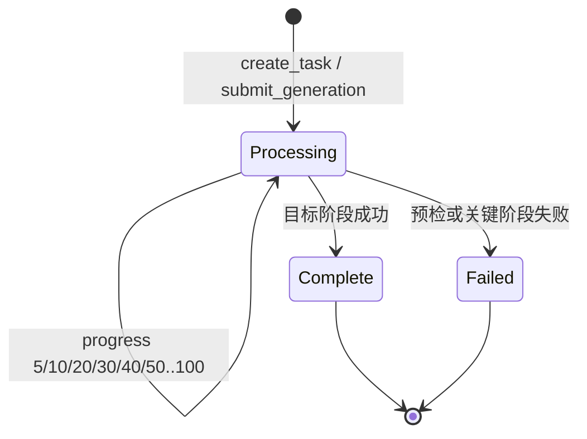

# MoneyPrinterTurbo 当前源码数据流

> 用途：二次开发前的系统地图。本文只描述当前源码，不是目标架构设计。
>
> 核对基线：Git `5ceffd0`，核对日期：2026-09-10。

## 1. 一句话结论

MoneyPrinterTurbo 当前是一条由 `app.services.task._run_pipeline()` 顺序编排的固定异步 Pipeline：入口负责参数接收和任务入队，后台线程按固定顺序执行脚本、关键词、音频、字幕、素材、剪辑、配乐与成片输出；`state` 只记录进度和结果，不决定下一步，因此它不是状态机，也不是 Agent。

## 2. 总调用图

```mermaid
flowchart TD
    U[用户输入]

    subgraph ENTRY[入口层]
        API[HTTP POST /api/v1/videos<br/>TaskVideoRequest]
        UI[Streamlit WebUI<br/>VideoParams]
        CLI[本地 CLI<br/>VideoParams]
    end

    U --> API
    U --> UI
    U --> CLI

    API --> CT[video.create_task]
    CT --> INIT_API[state.update_task<br/>创建 processing 记录]
    INIT_API --> API_TM[API TaskManager.add_task]
    API_TM --> START[task.start]

    UI --> SUBMIT[webui_task.submit_generation]
    SUBMIT --> INIT_UI[state.update_task<br/>创建 processing 记录]
    INIT_UI --> UI_TM[WebUI InMemoryTaskManager.add_task]
    UI_TM --> WORKER[webui_task._run_generation]
    WORKER --> START

    CLI --> START
    START --> PIPE[task._run_pipeline]
    PIPE --> PREFLIGHT[Provider Key 与 FFmpeg 预检]

    PREFLIGHT --> SCRIPT[1 generate_script]
    SCRIPT --> SCRIPT_INPUT{video_script 已提供?}
    SCRIPT_INPUT -- 是 --> USE_SCRIPT[直接使用用户脚本]
    SCRIPT_INPUT -- 否 --> LLM_SCRIPT[llm.generate_script<br/>build_script_prompt → _generate_response]

    USE_SCRIPT --> TERMS[2 generate_terms]
    LLM_SCRIPT --> TERMS
    TERMS --> LOCAL_TERMS{video_source == local?}
    LOCAL_TERMS -- 是 --> EMPTY_TERMS[跳过关键词生成]
    LOCAL_TERMS -- 否 --> TERMS_INPUT{video_terms 已提供?}
    TERMS_INPUT -- 是 --> USE_TERMS[标准化用户关键词]
    TERMS_INPUT -- 否 --> LLM_TERMS[llm.generate_terms]
    EMPTY_TERMS --> SAVE[save_script_data]
    USE_TERMS --> SAVE
    LLM_TERMS --> SAVE

    SAVE --> AUDIO[3 generate_audio]
    AUDIO --> AUDIO_SOURCE{音频来源}
    AUDIO_SOURCE -- WebUI 完整试听缓存 --> PREVIEW[复用任务目录 audio.mp3 与 SubMaker]
    AUDIO_SOURCE -- custom_audio_file --> CUSTOM[直接使用上传音频<br/>计算时长, SubMaker=None]
    AUDIO_SOURCE -- 默认 --> TTS[voice.tts<br/>输出 audio.mp3 与 SubMaker]

    PREVIEW --> SUBTITLE[4 generate_subtitle]
    CUSTOM --> SUBTITLE
    TTS --> SUBTITLE
    SUBTITLE --> SUB_ON{subtitle_enabled?}
    SUB_ON -- 否 --> NO_SUB[subtitle_path 为空]
    SUB_ON -- 是 --> SUB_PROVIDER{subtitle_provider}
    SUB_PROVIDER -- edge --> EDGE[voice.create_subtitle<br/>脚本文字 + TTS 时间轴]
    SUB_PROVIDER -- whisper --> WHISPER[subtitle.create<br/>从音频转写并可校正文案]
    SUB_PROVIDER -- 空或不满足条件 --> NO_SUB

    EDGE --> MATERIALS[5 get_video_materials]
    WHISPER --> MATERIALS
    NO_SUB --> MATERIALS
    MATERIALS --> MATERIAL_SOURCE{video_source}
    MATERIAL_SOURCE -- local --> LOCAL[video.preprocess_video]
    MATERIAL_SOURCE -- pexels/pixabay/coverr --> STOCK[material.download_videos<br/>搜索、筛选、下载]
    MATERIAL_SOURCE -- wavespeed/seedance/ofox/minimax --> AIVIDEO[按需生成 AI 视频并下载]
    MATERIAL_SOURCE -- openai_image --> AIIMAGE[按需生成图片素材]
    MATERIAL_SOURCE -- loomloom --> LOOM[LoomLoom 付费任务<br/>执行、轮询、下载]

    LOCAL --> FINAL_STAGE[6 generate_final_videos]
    STOCK --> FINAL_STAGE
    AIVIDEO --> FINAL_STAGE
    AIIMAGE --> FINAL_STAGE
    LOOM --> FINAL_STAGE

    FINAL_STAGE --> COMBINE[video.combine_videos]
    COMBINE --> COMBINED[combined-N.mp4<br/>纯画面时间线]
    COMBINED --> BGM{BGM 类型}
    BGM -- 本地/随机/无 --> RENDER[video.generate_video]
    BGM -- 视频配乐 Provider --> GEN_BGM[生成 BGM 文件]
    GEN_BGM --> RENDER
    RENDER --> FINAL[final-N.mp4<br/>旁白 + 字幕 + BGM]
    FINAL --> COMPLETE[state.update_task<br/>complete, progress=100]

    COMPLETE --> QUERY[GET /api/v1/tasks/task_id]
    QUERY --> URL[/tasks/task_id/final-N.mp4]
    URL --> STATIC[FastAPI StaticFiles 输出文件]

    COMPLETE -. 可选且不阻塞成片 .-> CROSS[_schedule_cross_post]
    CROSS --> PLATFORM[后台线程上传到配置的平台]

    PREFLIGHT -. 失败 .-> FAILED[state=failed + failed_stage + error]
    SCRIPT -. 失败 .-> FAILED
    TERMS -. 失败 .-> FAILED
    AUDIO -. 失败 .-> FAILED
    MATERIALS -. 失败 .-> FAILED
    FINAL_STAGE -. 失败 .-> FAILED
```

## 3. API 请求到后台任务

### 3.1 服务启动与路由注册

```text
main.py
  → uvicorn.run(app="app.asgi:app")
  → app.asgi.get_application()
  → FastAPI(..., lifespan=application_lifespan)
  → instance.include_router(root_api_router)
  → app.router.root_api_router
  → app.controllers.v1.video.router
  → POST /api/v1/videos
```

- `main.py`：读取 `config.listen_host`、`config.listen_port`、`config.reload_debug`，启动 ASGI 应用。
- `app/asgi.py::get_application()`：创建 FastAPI 实例、注册总路由和异常处理器。
- `app/asgi.py::application_lifespan()`：启动时记录鉴权状态并收敛中断的跨平台发布状态；`yield` 前是启动阶段，`yield` 后是关闭阶段。
- `app/router.py::root_api_router`：聚合 ping、video、llm 路由。
- `app/controllers/v1/base.py::new_router()`：为 V1 路由统一设置 `/api/v1` 前缀和依赖。
- `app/controllers/v1/video.py::router`：加载 `Depends(base.verify_token)`，因此 `/api/v1/videos` 受统一 API Key 规则保护。

### 3.2 创建任务

`app/controllers/v1/video.py::create_video()` 本身不生成视频，只调用：

```text
create_video(request, body: TaskVideoRequest)
  → create_task(request, body, stop_at="video")
  → utils.get_uuid()
  → state.update_task(task_id)
  → task_manager.add_task(task.start, task_id, params, stop_at)
  → 立即返回 HTTP 200 和 task_id
```

因此 HTTP 200 只说明任务已成功登记或入队，不说明视频生成完成。客户端必须继续查询 `GET /api/v1/tasks/{task_id}`。

### 3.3 后台线程与队列

- API 使用 `app.controllers.manager.memory_manager.InMemoryTaskManager`，启用 Redis 时改用 `RedisTaskManager`。
- 公共行为定义在 `app/controllers/manager/base_manager.py::TaskManager`。
- `add_task()` 在并发槽可用时调用 `execute_task()` 创建线程；槽位满时进入有上限队列；队列满时抛出 `TaskQueueFullError`。
- 工作线程运行 `run_task()`，内部调用 `task.start()`；结束后 `task_done()` 释放槽位并检查队列。

## 4. WebUI 数据流

WebUI 是 Streamlit 进程内调用，不经过 FastAPI HTTP 路由：

```text
webui/Main.py 表单与生成按钮
  → 组装 VideoParams
  → webui_task.submit_generation(task_id, params, ...)
  → state.update_task(... processing ...)
  → WebUI 专用 InMemoryTaskManager.add_task()
  → webui_task._run_generation()
  → config.runtime_config_lock()
  → task.start()
  → 与 API 共用 _run_pipeline()
```

WebUI 与 API 的入口和任务管理器不同，但从 `task.start()` 开始共用同一条业务流水线。

## 5. 核心阶段责任表

| 阶段 | 文件 / 类 | 核心函数 | 输入 | 输出 | 下一步 |
|---|---|---|---|---|---|
| 用户参数模型 | `app/models/schema.py` / `VideoParams`、`TaskVideoRequest` | Pydantic 校验 | subject、script、voice、source、subtitle、BGM、剪辑参数等 | `TaskVideoRequest`；它继承 `VideoParams`，没有新增字段 | `create_video()` |
| API 创建任务 | `app/controllers/v1/video.py` | `create_video()` → `create_task()` | `Request`、`TaskVideoRequest`、`stop_at="video"` | HTTP 200、`task_id`、参数快照 | `TaskManager.add_task()` |
| 任务调度 | `app/controllers/manager/base_manager.py` / `TaskManager` | `add_task()`、`execute_task()`、`run_task()` | `task.start` 及参数 | 后台线程或队列项 | `task.start()` |
| 流程编排 | `app/services/task.py` | `start()` → `_run_pipeline()` | `task_id`、`VideoParams`、`stop_at`、可选预览/报价 | 完整结果字典或失败字典 | 固定顺序调用各阶段 |
| LLM 脚本 | `app/services/task.py`、`app/services/llm.py` | `generate_script()`、`llm.generate_script()`、`build_script_prompt()`、`_generate_response()` | 主题、语言、段落数、自定义提示词；或用户现成脚本 | `video_script: str` | `generate_terms()` |
| LLM 关键词 | `app/services/task.py`、`app/services/llm.py` | `generate_terms()`、`llm.generate_terms()` | 主题、脚本、用户关键词、顺序匹配开关 | `video_terms: list[str]`；本地素材模式为空字符串 | `save_script_data()`、`generate_audio()` |
| TTS / 自定义音频 | `app/services/task.py`、`app/services/voice.py` | `generate_audio()`、`voice.tts()` | 脚本、音色、语速、上传音频或 WebUI 试听缓存 | `audio_file`、`audio_duration`、`sub_maker` | `generate_subtitle()` |
| 字幕 | `app/services/task.py`、`app/services/voice.py`、`app/services/subtitle.py` | `generate_subtitle()`、`voice.create_subtitle()` 或 `subtitle.create()` | 脚本、音频、SubMaker、字幕模式 | `subtitle.srt` 路径或空字符串 | `get_video_materials()` |
| 素材 | `app/services/task.py`、`app/services/material.py` | `get_video_materials()`、`material.download_videos()` | 关键词、素材源、画幅、音频总时长、片段时长 | 本地素材路径列表 | `generate_final_videos()` |
| 镜头拼接 | `app/services/task.py`、`app/services/video.py` | `generate_final_videos()` → `video.combine_videos()` | 素材路径、画幅、拼接/转场/速度参数、音频 | `combined-N.mp4` | BGM 处理和 `video.generate_video()` |
| BGM 与成片 | `app/services/task.py`、`app/services/video.py`、`app/services/bgm.py` | Provider `generate_bgm()`、`video.generate_video()` | combined 视频、旁白、字幕、BGM、`VideoParams` | `final-N.mp4`；并返回 BGM 降级警告 | `state.update_task(complete)` |
| 状态查询 | `app/services/state.py`、`app/controllers/v1/video.py` | `update_task()`、`get_task()` | `task_id`、进度、阶段产物或错误 | 可查询任务快照和文件 URI | `/tasks/...` 静态文件 |
| 文件输出 | `app/utils/utils.py`、`app/asgi.py` | `utils.task_dir()`、`app.mount("/tasks", StaticFiles(...))` | `storage/tasks/{task_id}` 下的文件 | HTTP 文件响应 | 用户下载/播放 |

## 6. `_run_pipeline()` 的真实执行顺序

`app/services/task.py::_run_pipeline()` 是二次开发时最重要的流程锚点，当前顺序是：

1. 写入 `processing, progress=5`。
2. 预检 AI 素材 Provider、视频配乐 Provider 和 FFmpeg。
3. `generate_script()`。
4. `generate_terms()`；`video_source == "local"` 时跳过。
5. `save_script_data()` 将脚本、关键词、参数写入任务产物。
6. `generate_audio()`。
7. `generate_subtitle()`。
8. `get_video_materials()`。
9. `generate_final_videos()`。
10. 写入 `complete, progress=100`，保存视频、脚本、关键词、音频、字幕、素材和警告。
11. 如果启用了自动发布，调用 `_schedule_cross_post()`；它不阻塞已经完成的成片任务。

`stop_at` 可在 `script`、`terms`、`audio`、`subtitle`、`materials` 提前结束，API 中 `/audio` 与 `/subtitle` 正是复用这套机制。它是确定性的阶段短路，不是模型自主决定流程。

## 7. 关键分支

### 7.1 脚本分支

- `params.video_script` 非空：直接使用用户脚本，不调用 LLM。
- 否则调用 `llm.generate_script()`。
- `custom_system_prompt` 替换默认系统规则；`video_script_prompt` 作为附加用户要求拼入 Prompt。

### 7.2 音频与字幕分支

- 默认：`voice.tts()` 生成 `audio.mp3` 和 `sub_maker`。
- WebUI 缓存：参数完全匹配时复用完整试听音频和时间轴。
- 自定义音频：直接使用任务目录内文件，返回 `sub_maker=None`。
- Edge 字幕依赖 TTS 返回的 `sub_maker`；自定义音频不能直接走 Edge 字幕。
- Whisper 字幕直接从 `audio_file` 转写，因此可以处理上传的人声音频。
- 这叫“语音转字幕”，不是声音克隆；当前主链没有上传一段样音后训练/克隆新音色的步骤。

### 7.3 素材分支

- `local`：预处理用户提供的本地素材。
- `pexels` / `pixabay` / `coverr`：搜索、缓存、筛选和下载库存素材。
- `wavespeed` / `volcengine_seedance` / `ofox` / `metaso_minimax`：按音频所需时长逐段生成 AI 视频，避免超量付费。
- `openai_image`：按需生成图片素材，再参与视频时间线。
- `loomloom`：需要已确认报价，创建远端付费任务、轮询并下载结果。

所以项目已经支持“不使用库存素材”的 AI 素材来源，但这些 Provider 仍被固定 Pipeline 调用；它们自身不等于视频 Agent。

### 7.4 合成与文件语义

- `combined-N.mp4`：`video.combine_videos()` 产生的镜头时间线中间文件。
- `final-N.mp4`：`video.generate_video()` 将旁白、字幕和 BGM 合成后的最终文件。
- 实际目录由 `utils.task_dir(task_id)` 决定，即 `storage/tasks/{task_id}/`。
- API 查询将本地路径转换为 `/tasks/{task_id}/final-N.mp4` URI。
- `/tasks` 是独立的 `StaticFiles` 挂载，不能继承 APIRouter 依赖，所以 `app/asgi.py::protect_generated_task_files()` 再调用同一个 `verify_token()` 鉴权。

## 8. 状态与失败数据流



这张图只是任务状态变化图，不代表源码采用状态机编排。源码中没有根据当前状态选择下一处理器的转移表；下一步由 `_run_pipeline()` 的普通 Python 顺序语句决定。

失败统一经 `_mark_task_failed()` 写入：

```text
state = TASK_STATE_FAILED
progress = 当前失败进度规则
failed_stage = preflight | script | terms | audio | materials | video | pipeline ...
error = 错误信息
```

字幕失败和某些第三方 BGM 失败允许降级为无字幕或无 BGM 成片；脚本、关键词、音频、素材和最终视频为空通常会终止整个任务。

## 9. 为什么当前不是 Agent

源码依据：

1. `_run_pipeline()` 写死了阶段顺序。
2. LLM 只产出脚本和搜索关键词，不能选择或新增工具调用。
3. 没有“观察结果 → 重新规划 → 再行动”的循环。
4. 没有动态任务图、工具注册表、Agent memory 或模型驱动的终止条件。
5. `state` 记录任务结果，`TaskManager` 管理线程和队列，两者都不做内容决策。

准确分类是：**固定异步 Pipeline + 任务状态记录 + 条件分支 + 有限降级策略**。

## 10. 二次开发前的代码阅读入口

按优先级阅读：

1. `app/services/task.py`：完整业务编排，先读 `_run_pipeline()`，再回读每个阶段函数。
2. `app/models/schema.py`：输入数据契约，重点是 `VideoParams` 和 `TaskVideoRequest`。
3. `app/controllers/v1/video.py`：API 创建、查询、删除、上传和文件 URI。
4. `app/controllers/manager/base_manager.py`：并发槽位、线程与队列生命周期。
5. `app/services/state.py`：内存/Redis 状态结构与更新语义。
6. `app/services/llm.py`：脚本、关键词 Prompt 和 Provider 分发。
7. `app/services/material.py`：库存素材与 AI 素材的统一分发入口。
8. `app/services/voice.py`：TTS、音频时长和 Edge 字幕时间轴。
9. `app/services/subtitle.py`：Whisper 转写与字幕校正。
10. `app/services/video.py`：素材预处理、镜头拼接和最终音视频合成。

辅助入口：

- `webui/Main.py`：Streamlit 表单如何形成 `VideoParams`。
- `app/services/webui_task.py`：WebUI 后台任务如何接入共享 Pipeline。
- `app/asgi.py`、`app/router.py`：FastAPI 生命周期、路由和静态文件。
- `app/config/config.py`：`config.toml` 的生成、加载、运行时锁和保存。

## 11. 二次开发时必须保护的边界

以下不是重构方案，而是从当前数据流直接得到的约束：

- 任务必须在线程或队列接管前写入状态；调度失败必须留下失败终态或回滚记录。
- HTTP/WebUI 上传文件必须限制在当前任务目录，不能把用户字符串直接当服务器路径读取。
- AI 视频和配乐调用可能产生付费副作用，远端任务 ID 和失败阶段必须保留。
- 音频时长决定素材需求量、BGM 时长和最终时间线，不能把素材阶段随意提前到音频之前。
- `combined-N.mp4` 与 `final-N.mp4` 是两个不同阶段的契约，不应混为一个产物。
- API 和 WebUI 应继续共享一个核心执行入口，否则相同参数可能产生不同结果。

## 12. 最小记忆版

```text
用户输入
→ API/WebUI/CLI 形成 VideoParams
→ 建立 task_id 与 processing 状态
→ TaskManager 后台执行 task.start
→ _run_pipeline 固定编排
→ 脚本（用户提供或 LLM）
→ 关键词（用户提供或 LLM；本地素材跳过）
→ 音频（试听缓存 / 自定义音频 / TTS）
→ 字幕（Edge 时间轴 / Whisper 音频转写 / 无字幕）
→ 素材（本地 / 库存搜索下载 / AI 生成）
→ combine_videos 生成 combined-N.mp4
→ BGM 选择或生成
→ generate_video 生成 final-N.mp4
→ state complete
→ 查询任务
→ 经鉴权访问 /tasks/{task_id}/final-N.mp4
```

