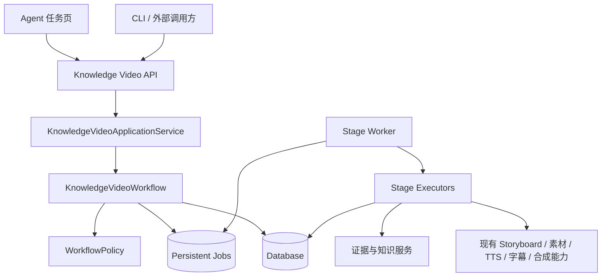

# 知识视频 Agent 统一工作流设计

日期：2026-09-11
状态：已完成产品与架构设计确认，等待实施计划评审

## 1. 背景与问题

当前项目同时存在三条业务执行路径：原始 Streamlit 一键成片流程、Streamlit 分镜工作台直调 Service/Repository 的流程，以及 FastAPI Storyboard 接口流程。三条路径对任务状态、后台执行、异常处理和恢复策略的定义不一致。现有实现已经具备 ContentPlan、Storyboard、AssetRoutePlan、ExecutionRun、TTS、字幕、BGM 和视频合成等能力，但尚未形成一个以知识证据为核心、从用户目标持续运行到最终交付物的统一工作流。

本设计选择在现有项目内收口，而不是重写整个系统。新 Agent 任务页成为唯一主入口；原始视频 Pipeline 保留为内部媒体执行能力和过渡兼容接口，不再作为独立产品流程。

## 2. 目标

系统对用户只暴露一个 `KnowledgeVideoTask`。用户提交主题、资料和生产参数后，同一个任务依次完成证据分析、知识规划、脚本、分镜、素材、音频、合成、质量检查和交付。

知识视频 Agent 必须具备以下区别于普通文案生成器的能力：

- 优先使用用户上传的文件、文本和链接。
- 证据不足时，在取得用户授权后联网补充。
- 核心事实没有可靠证据时停止推进并进入 `NEEDS_EVIDENCE`。
- 保存知识点、脚本段落、视频时间范围与原始证据之间的映射。
- 识别来源冲突、证据不足和基于证据的推断。
- 根据知识表达需要选择 AI 视频、AI 图片、信息图、用户素材、搜索素材或文字动画。
- 质量检查失败时只返工受影响阶段或镜头。
- 输出视频、字幕、来源报告和完整执行记录。

## 3. 非目标

第一版不追求以下能力：

- 不重写已有 TTS、字幕、BGM 和 MoviePy 合成内部实现。
- 不删除旧接口；旧接口仅保留兼容性并标记为 Legacy。
- 不在第一版引入 WebSocket，任务状态使用轮询或 SSE。
- 不允许 LLM 在没有状态机约束的情况下无限自主循环。
- 不把模型自身记忆视为严格模式下的事实证据。
- 不把搜索结果摘要直接视为最终证据。

## 4. 用户体验

主界面为统一 Agent 任务页，包含任务列表、任务阶段时间线和当前阶段详情。用户不再选择“一键成片”或“分镜工作台”。

创建任务时输入：

- 主题和目标受众
- 上传文件、粘贴文本或网页链接
- 视频时长、画面比例和讲解风格
- 自动策略或审核策略
- 是否允许联网补充
- 预算和可用模型

自动策略和审核策略共享完全相同的工作流。自动策略仅在证据不足、事实冲突、付费授权或不可自动恢复错误时暂停；审核策略默认在证据与知识提纲、脚本与分镜、最终预览三个节点暂停。

用户修改中间产物时，系统创建新的产物版本，标记受影响的下游产物为 `STALE`，并从最早受影响阶段继续执行。未受影响的镜头和素材继续复用。

## 5. 总体架构



核心职责：

- `KnowledgeVideoTask`：任务聚合根，保存目标、策略、状态、当前阶段和最终交付物。
- `KnowledgeVideoWorkflow`：唯一编排器，只负责状态转换、暂停、恢复和下一个 Job 的创建。
- `WorkflowPolicy`：决定自动策略与审核策略的暂停点、预算限制和重试上限。
- `StageExecutor`：执行单个阶段，读取明确版本的输入产物并生成不可变输出产物。
- `StageExecution`：记录一次执行的输入、输出、模型、耗时、错误和重试信息。
- `ArtifactRevision`：保存知识提纲、脚本、分镜等不可变版本及其依赖关系。
- `StageWorker`：通过租约领取持久化 Job，执行并提交结果。

## 6. 统一数据流

```text
EVIDENCE
→ KNOWLEDGE_PLAN
→ SCRIPT
→ STORYBOARD
→ PRODUCTION_PLAN
→ ASSET
→ AUDIO
→ COMPOSITION
→ QUALITY_REVIEW
→ DELIVERY
```

### 6.1 Evidence

解析用户资料，必要时在授权范围内联网研究，输出来源文档、证据项、冲突项和覆盖报告。核心知识点缺少证据时进入 `NEEDS_EVIDENCE`。

### 6.2 Knowledge Plan

根据证据形成核心问题、概念、知识点顺序、案例与总结结构。每个事实型知识点必须绑定证据。

### 6.3 Script

生成可讲述的旁白段落。每个段落绑定知识点、证据、传播目标和目标时长。模型可以优化表达，但不能新增无证据事实。

### 6.4 Storyboard

把旁白段落转换为镜头。每个镜头绑定旁白段落、视觉目标、素材类型、生成提示词、时长和证据引用。

### 6.5 Production Plan 与生产

Agent 为每个镜头选择 AI 视频、AI 图片加运镜、信息图、用户素材、搜索素材或文字动画。随后复用现有素材、TTS、字幕、BGM 和视频合成能力完成生产。

### 6.6 Quality Review

检查事实证据覆盖、知识提纲覆盖、旁白与画面一致性、字幕完整性、音视频时长、素材文件完整性和目标时长。失败时只创建受影响阶段的返工 Job；达到重试或预算上限后进入 `NEEDS_RECOVERY`。

### 6.7 Delivery

交付 `final.mp4`、`final.srt`、来源报告和执行清单。视频默认不烧录引用编号，引用通过来源报告和任务页面查看。

## 7. 证据与引用模型

`SourceDocument` 保存来源类型、标题、URL、本地快照、内容哈希、作者、发布时间、抓取时间和元数据。网页证据必须保存正文快照和哈希，不能只保存 URL。

`EvidenceItem` 保存来源、页码/章节/段落/时间码定位、原始摘录、规范化事实、证据类型、置信度和提取方式。

`KnowledgeClaim` 区分 `FACT`、`INTERPRETATION` 和 `OPINION`，并保存证据引用、验证状态、冲突引用及使用该知识点的脚本段落。

一次研究结果形成不可变的 `EvidenceSnapshot`。补充资料后生成新快照，只重新验证受影响的 KnowledgeClaim 和下游产物。

用户资料优先使用但不自动视为正确。来源质量按官方文档/原始数据、同行评审研究、权威专业出版物、二手媒体、博客与社交内容分层评估。低质量来源可以用于发现线索，但不能单独支撑严格模式下的核心结论。

## 8. 状态与持久化 Job

任务状态和当前阶段分别保存：

```text
task_status:
CREATED | RUNNING | WAITING_USER | NEEDS_EVIDENCE |
NEEDS_RECOVERY | COMPLETED | FAILED | CANCELLED

current_stage:
EVIDENCE | KNOWLEDGE_PLAN | SCRIPT | STORYBOARD |
PRODUCTION_PLAN | ASSET | AUDIO | COMPOSITION |
QUALITY_REVIEW | DELIVERY
```

每个阶段对应一个持久化 Job。Job 包含幂等键、领取租约、心跳、最大执行时间、重试次数、输入产物版本和输出产物版本。数据库是任务和 Job 的权威来源；Redis只负责唤醒、队列加速或事件通知。

API 请求不执行耗时生产任务。API 在事务中创建任务或命令及对应 Job 后返回 `202 Accepted`。Worker 重启后扫描未领取 Job 和租约过期 Job，从而恢复中断任务。

错误分为：

- `RETRYABLE`：超时、限流和临时服务错误。
- `NEEDS_EVIDENCE`：证据不足或事实冲突。
- `NEEDS_USER`：等待审核、预算或联网授权。
- `NEEDS_RECOVERY`：自动重试达到上限或需要改变生产策略。
- `FATAL`：配置、数据约束或不可继续的系统错误。

## 9. API 边界

核心接口：

```text
POST /api/v1/knowledge-video-tasks
GET  /api/v1/knowledge-video-tasks/{task_id}
GET  /api/v1/knowledge-video-tasks/{task_id}/events
GET  /api/v1/knowledge-video-tasks/{task_id}/artifacts

POST /api/v1/knowledge-video-tasks/{task_id}/approve
POST /api/v1/knowledge-video-tasks/{task_id}/revise
POST /api/v1/knowledge-video-tasks/{task_id}/evidence
POST /api/v1/knowledge-video-tasks/{task_id}/authorize-research
POST /api/v1/knowledge-video-tasks/{task_id}/retry
POST /api/v1/knowledge-video-tasks/{task_id}/cancel
```

WebUI、CLI 和外部调用方都使用这些命令与查询接口。WebUI 不允许直接导入 Repository、数据库 Session 或媒体 Service。第一版每 2–3 秒轮询状态；后续可以切换为 SSE，不改变任务模型。

## 10. 建议代码边界

```text
app/domain/
  knowledge_video_task.py
  evidence.py
  workflow_state.py
  artifacts.py

app/application/
  knowledge_video_workflow.py
  workflow_policy.py
  task_command_service.py
  task_query_service.py

app/workers/
  stage_worker.py
  job_recovery.py

app/controllers/v1/
  knowledge_video.py

webui/
  knowledge_video_agent_page.py
```

Domain 不调用模型或基础设施；Application 负责业务用例与编排；Worker 负责可靠执行；Service/Adapter 负责模型与媒体能力；Controller 只处理传输层；WebUI 只展示和发送命令。

## 11. 现有代码迁移策略

1. 建立统一任务、状态、Job、命令与查询接口，不改底层媒体实现。
2. 建立 SourceDocument、EvidenceItem、KnowledgeClaim 和 EvidenceSnapshot。
3. 将现有 ContentPlan、Storyboard、AssetRoutePlan、ExecutionRun 包装为阶段产物或执行器。
4. 将现有 TTS、字幕、BGM 和视频合成包装为 StageExecutor。
5. 建立统一 Agent 任务页，并停止 WebUI 对 Repository/Session/Service 的直接调用。
6. 原一键成片页面和独立分镜工作台退出主导航；旧接口保留为 Legacy。
7. 完成证据检查、局部失效、局部返工和最终交付。

迁移期间不同时重写底层模型适配器。每接入一个阶段，都先建立契约测试和一条可重复的离线执行路径。

## 12. 验收标准

第一版必须满足：

1. 用户只能通过统一 Agent 任务页创建知识视频任务。
2. 一个 `task_id` 贯穿研究、生产、审核、恢复和交付。
3. 用户可以上传资料，也可以授权联网补充。
4. 核心知识点无证据时任务进入 `NEEDS_EVIDENCE`。
5. 审核策略在三个确认节点暂停；自动策略走相同工作流。
6. 修改一个脚本段落只重跑受影响镜头及其下游阶段。
7. 服务重启后，未完成任务可以从持久化 Job 恢复。
8. WebUI 不直接访问 Repository 或数据库 Session。
9. API、WebUI 和 CLI 返回同一个任务状态。
10. 最终交付 MP4、SRT、来源报告和执行记录。
11. 每个事实型脚本段落可以追溯到 EvidenceItem 和 SourceDocument。
12. 原一键成片和分镜工作台不再作为两个独立产品入口。

## 13. 测试策略

- Domain：状态转换、证据约束、版本失效和重试上限单元测试。
- Persistence：任务、Job、租约、ArtifactRevision 和 EvidenceSnapshot 仓储测试。
- Application：自动策略与审核策略使用同一工作流的契约测试。
- Worker：幂等执行、租约过期、进程重启和局部恢复测试。
- API：创建、审核、补证据、授权、重试、取消和查询测试。
- UI：确认页面只调用 API，不直接导入持久化层。
- 离线端到端：使用固定证据与本地媒体，从任务创建运行到四类交付物。
- 真实集成：单独验证联网研究、LLM、TTS 和视频模型，不混入默认快速测试。

## 14. 实施规模

预计可演示统一纵向流程需要 3–5 个工作日；包含证据链、统一页面和局部恢复的 MVP 需要 10–15 个工作日；包含真实联网研究、多模型联调、完整部署与可靠性验证需要约 4–6 周。

正式实施前应先建立当前分支的可追溯 Git 基线，确保现有大量未提交 Agentic 代码与后续统一工作流改造可以分开审查。
